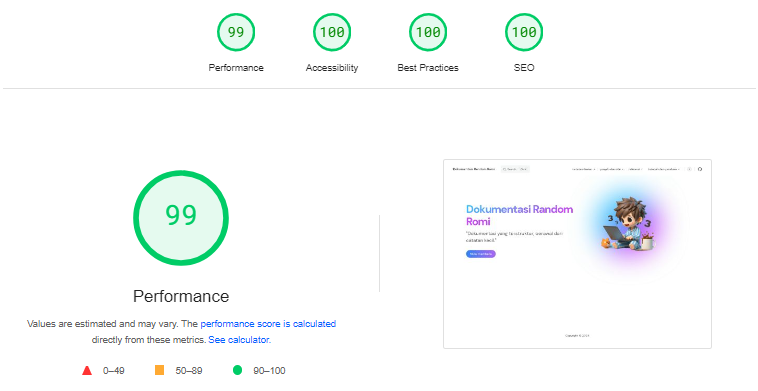

# Dokumentasi Random Romi

Selamat datang di repositori Dokumentasi Random Romi. Di sini gue kumpulin berbagai catatan harian, proyek, tutorial, dan referensi yang berguna. Dokumentasi ini dibuat menggunakan VitePress.

## Struktur Proyek

Berikut adalah struktur folder dan file dalam proyek ini:

```
docs
├── .vitepress
│   └── config.ts
├── index.md
├── catatan-harian
│   ├── index.md
│   └── hari-pertama.md
├── proyek-dan-ide
│   ├── index.md
│   └── proyek-pertama.md
├── tutorial-dan-panduan
│   ├── index.md
│   └── tutorial-pertama.md
└── referensi
    ├── index.md
    └── referensi-pertama.md
```

## Instalasi

Pastikan lo udah punya Node.js dan npm terinstal di sistem lo. Kemudian ikuti langkah-langkah berikut:

1. Clone repositori ini:
    ```sh
    git clone https://github.com/leuthra/documentation.git
    cd documentation
    ```

2. Instal dependensi:
    ```sh
    npm install
    ```

## Menjalankan Server Pengembangan

Untuk menjalankan server pengembangan dan melihat dokumentasi lo secara lokal:

```sh
npx vitepress dev docs
```

Buka browser dan pergi ke `http://localhost:3000` untuk melihat dokumentasi.

## Membuat Build untuk Produksi

Untuk membuat build statis untuk produksi:

```sh
npx vitepress build docs
```

Hasil build akan tersedia di folder `docs/.vitepress/dist`.

## Menambahkan Konten Baru

Untuk menambahkan konten baru, lo bisa buat file markdown baru di folder yang sesuai:

- **Catatan Harian:** Tambahkan file di dalam folder `docs/catatan-harian`.
- **Proyek dan Ide:** Tambahkan file di dalam folder `docs/proyek-dan-ide`.
- **Tutorial dan Panduan:** Tambahkan file di dalam folder `docs/tutorial-dan-panduan`.
- **Referensi:** Tambahkan file di dalam folder `docs/referensi`.

Jangan lupa untuk menambahkan link ke file baru lo di `config.ts` supaya bisa diakses dari sidebar.

### Pagespeed
### Pagespeed
Dalam proyek ini, kecepatan halaman telah dioptimalkan, namun ini bisa menjadi salah satu yang sangat bisa ditingkatkan lebih baik lagi.



## Kontribusi

Kalau lo punya ide atau perbaikan untuk dokumentasi ini, jangan ragu buat kontribusi. Lo bisa fork repositori ini, buat perubahan di branch lo, dan kirim pull request.

## Thanks to

Terima kasih kepada semua yang telah membantu dan memberikan kontribusi untuk dokumentasi ini. Khususnya:

- Tim VitePress untuk alat dokumentasi yang hebat ini.
- Komunitas open source untuk dukungan dan inspirasi.
- [@zakirkun](https://github.com/zakirkun/) sebagai penyedia template

## Lisensi

Repositori ini dilisensikan di bawah [MIT License](LICENSE).
